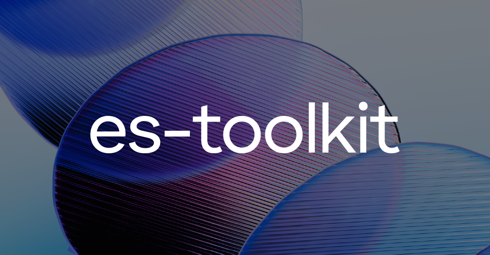

# es-toolkit &middot; [](https://github.com/toss/slash/blob/main/LICENSE) [](https://codecov.io/gh/toss/es-toolkit) [](https://www.npmjs.com/package/es-toolkit) [](https://jsr.io/@es-toolkit/es-toolkit) [](https://discord.gg/vGXbVjP2nY)

[English](https://github.com/toss/es-toolkit/blob/main/README.md) | [한국어](https://github.com/toss/es-toolkit/blob/main/README-ko_kr.md) | [简体中文](https://github.com/toss/es-toolkit/blob/main/README-zh_hans.md) | 日本語

es-toolkitは、最先端のJavaScriptユーティリティライブラリであり、高性能で小さなバンドルサイズ、強力な型注釈を提供します。

- es-toolkitは、[debounce](https://es-toolkit.slash.page/reference/function/debounce.html)、[delay](https://es-toolkit.slash.page/reference/promise/delay.html)、[chunk](https://es-toolkit.slash.page/reference/array/chunk.html)、[sum](https://es-toolkit.slash.page/reference/math/sum.html)、[pick](https://es-toolkit.slash.page/reference/object/pick.html)など、日常的に使用するさまざまなユーティリティ関数を最新の実装で提供します。
- パフォーマンスを重視して設計されており、es-toolkitは最新のJavaScript環境で[2-3倍の性能向上](https://es-toolkit.slash.page/performance.html)を実現します。
- es-toolkitはツリーシェイキングをサポートしており、他のライブラリと比較してJavaScriptコードを最大[97%削減](https://es-toolkit.slash.page/bundle-size.html)します。
- es-toolkitには組み込みのTypeScriptサポートが含まれており、直感的で堅牢な型を提供します。また、[isNotNil](https://es-toolkit.slash.page/reference/predicate/isNotNil.html)などの便利な型ガードも提供します。
- es-toolkitは100%のテストカバレッジを持ち、信頼性と堅牢性を確保しています。

## 例

```tsx
// jsrでは '@es-toolkit/es-toolkit' からインポートします。
import { debounce, chunk } from 'es-toolkit';

const debouncedLog = debounce(message => {
  console.log(message);
}, 300);

// この呼び出しはデバウンスされます
debouncedLog('Hello, world!');

const array = [1, 2, 3, 4, 5, 6];
const chunkedArray = chunk(array, 2);

console.log(chunkedArray);
// 出力: [[1, 2], [3, 4], [5, 6]]
```

## 貢献

コミュニティの皆さんからの貢献を歓迎します。詳細な貢献ガイドについては、以下をお読みください。

[CONTRIBUTING](https://github.com/toss/es-toolkit/blob/main/.github/CONTRIBUTING.md)

## ライセンス

MIT © Viva Republica, Inc. 詳細については[LICENSE](./LICENSE)をご覧ください。

<a title="Toss" href="https://toss.im">
  <picture>
    <source media="(prefers-color-scheme: dark)" srcset="https://static.toss.im/logos/png/4x/logo-toss-reverse.png">
    
  </picture>
</a>
