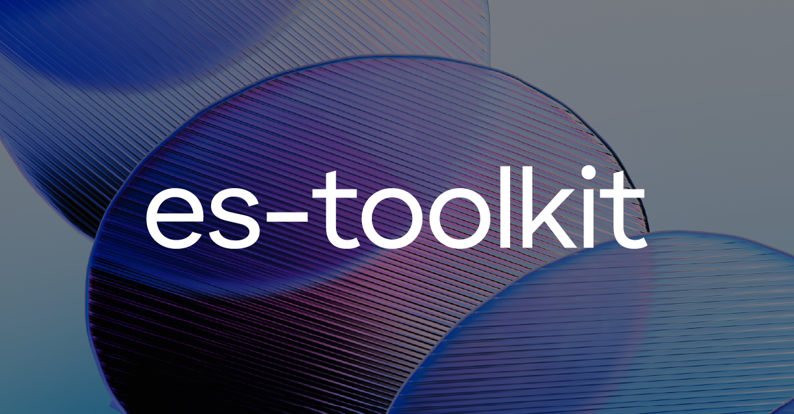

# es-toolkit &middot; [](https://github.com/toss/slash/blob/main/LICENSE) [](https://codecov.io/gh/toss/es-toolkit) [](https://www.npmjs.com/package/es-toolkit) [](https://jsr.io/@es-toolkit/es-toolkit) [](https://discord.gg/vGXbVjP2nY)

English | [한국어](https://github.com/toss/es-toolkit/blob/main/README-ko_kr.md) | [简体中文](https://github.com/toss/es-toolkit/blob/main/README-zh_hans.md) | [日本語](https://github.com/toss/es-toolkit/blob/main/README-ja_jp.md)

es-toolkit is a state-of-the-art, high-performance JavaScript utility library with a small bundle size and strong type annotations.

- es-toolkit offers a variety of everyday utility functions with modern implementations, such as [debounce](https://es-toolkit.dev/reference/function/debounce.html), [delay](https://es-toolkit.dev/reference/promise/delay.html), [chunk](https://es-toolkit.dev/reference/array/chunk.html), [sum](https://es-toolkit.dev/reference/math/sum.html), and [pick](https://es-toolkit.dev/reference/object/pick.html).
- Designed with performance in mind, es-toolkit achieves [2-3× better performance](https://es-toolkit.dev/performance.html) in modern JavaScript environments.
- es-toolkit supports tree shaking out of the box, and [reduces JavaScript code by up to 97%](https://es-toolkit.dev/bundle-size.html) compared to other libraries.
- es-toolkit offers a complete compatibility layer to seamlessly replace lodash, available as [es-toolkit/compat](https://es-toolkit.dev/compatibility.html).
- es-toolkit includes built-in TypeScript support, with straightforward yet robust types. It also provides useful type guards such as [isNotNil](https://es-toolkit.dev/reference/predicate/isNotNil.html).
- es-toolkit is utilized by several popular open-source libraries, such as [Storybook](https://github.com/storybookjs/storybook/blob/9d862798d666678cc4822e857c00bbd744169ced/code/core/package.json#L358) and [ink](https://github.com/vadimdemedes/ink/blob/2090ad9779be59dea71d173eb49785b7bd4495d0/package.json#L55).
- es-toolkit is battle-tested with 100% test coverage, ensuring reliability and robustness.

## Examples

```tsx
// import from '@es-toolkit/es-toolkit' in jsr.
import { chunk, debounce } from 'es-toolkit';

const debouncedLog = debounce(message => {
  console.log(message);
}, 300);

// This call will be debounced
debouncedLog('Hello, world!');

const array = [1, 2, 3, 4, 5, 6];
const chunkedArray = chunk(array, 2);

console.log(chunkedArray);
// Output: [[1, 2], [3, 4], [5, 6]]
```

## Contributing

We welcome contribution from everyone in the community. Read below for detailed contribution guide.

[CONTRIBUTING](https://github.com/toss/es-toolkit/blob/main/.github/CONTRIBUTING.md)

## License

MIT © Viva Republica, Inc. See [LICENSE](./LICENSE) for details.

<a title="Toss" href="https://toss.im">
  <picture>
    <source media="(prefers-color-scheme: dark)" srcset="https://static.toss.im/logos/png/4x/logo-toss-reverse.png">
    
  </picture>
</a>
