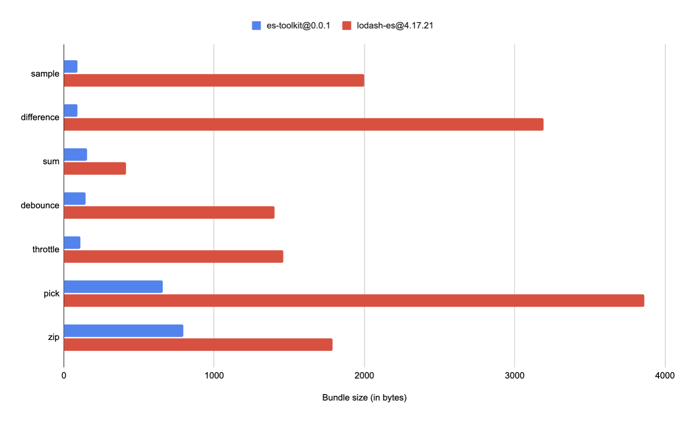

Bundle Footprint
============

With its modern implementation, es-toolkit significantly reduces its bundle size, cutting it down by up to 97% compared to other libraries like lodash. 

This makes es-toolkit the most efficient in terms of bundle size, with some utility functions being as small as less than 100 bytes.

## Bundle Footprint Comparison

|                                               | es-toolkit@0.0.1 | lodash-es@4.17.21 | Difference |
|-----------------------------------------------|------------------|--------------------|------------|
| [sample](./reference/array/sample.md)         |	88 bytes         |	2000 bytes        |	-95.6%    |
| [difference](./reference/array/difference.md) |	91 bytes         |	3190 bytes        |	-97.2%    |
| [sum](./reference/math/sum.md)                |	152 bytes        |	413 bytes         | -63.2%    |
| [debounce](./reference/function/debounce.md)  |	144 bytes        |	1400 bytes        |	-89.7%    |
| [throttle](./reference/function/throttle.md)  |	110 bytes        |	1460 bytes        |	-92.5%    |
| [pick](./reference/object/pick.md)            |	657 bytes        |	3860 bytes        |	-83.0%    |
| [zip](./reference/array/zip.md)               |	797 bytes        |	1790 bytes        |	-55.5%    |

