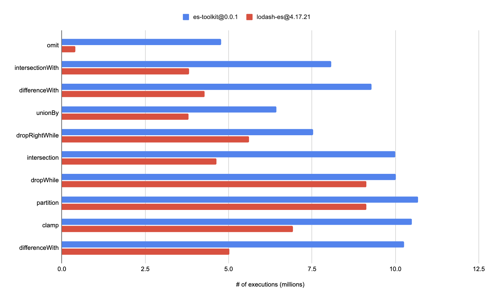

Performance
============

Designed with performance in mind, es-toolkit provides an average of 2× performance improvement compared to alternative libraries like lodash. Some functions achieve up to an 11× performance gain by fully utilizing modern JavaScript APIs.

## Performance Comparison

|                                                          | es-toolkit@0.0.1 | lodash-es@4.17.21 | Difference |
|-----------------------------------------------------------|------------------|--------------------|------------|
| [omit](./reference/object/omit.md)                        |	4,767,360 times  |	403,624 times     |	11.8×     |
| [intersectionWith](./reference/array/intersectionWith.md) |	8,074,722 times  |	3,814,479 times   |	2.12×   |
| [intersection](./reference/array/intersection.md)         |	9,999,571 times  |	4,630,316 times   |	2.15×   |
| [differenceWith](./reference/array/differenceWith.md)     |	9,291,897 times  |	4,275,222 times   |	2.17×   |
| [unionBy](./reference/array/unionBy.md)                   |	6,435,983 times  |	3,794,899 times   | 1.69×   |
| [groupBy](./reference/array/groupBy.md)                   |	5,000,235 times  |	5,206,286 times   | 0.96×   |

